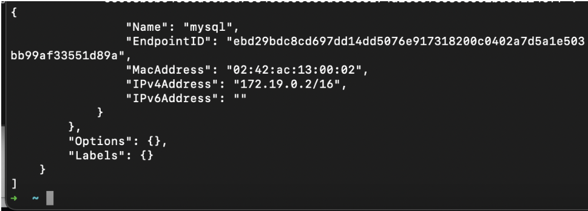
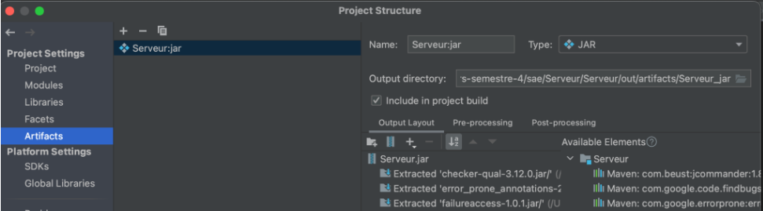
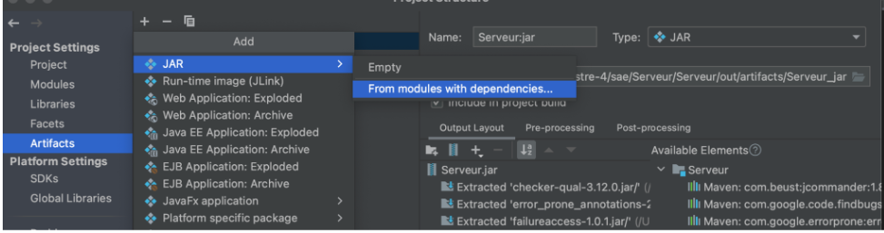
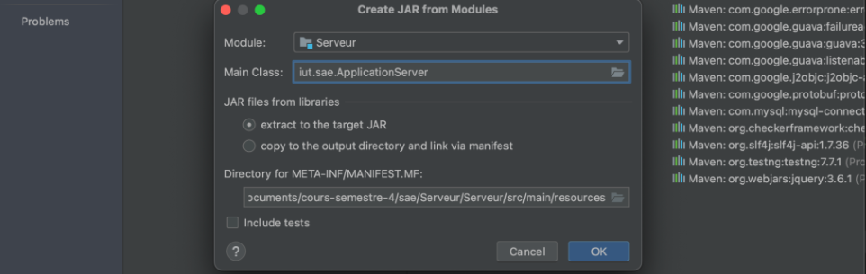
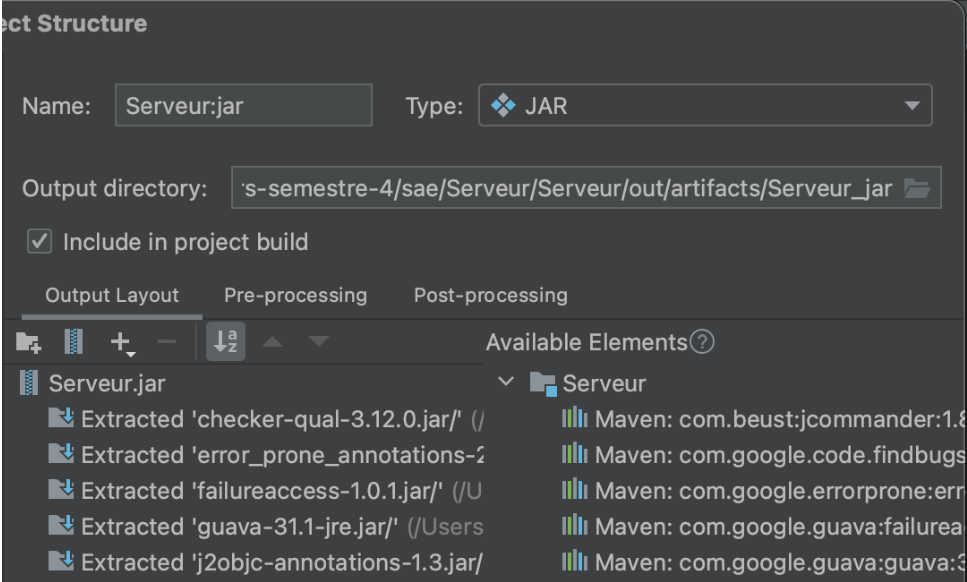

# TD-virtualisation-SAE-Serveur

Dronne Laura
Surina Margarita 

Lors du semestre dernier nous avons dû mettre au point une application de e-vote. Cette application était composé de 3 composants principaux: le serveur,le scrutateur et enfin le client. Le but de ce TD a été de virtualiser le serveur ainsi que la base de données.  

Pour que les deux services puissent communiquer entre eux il fallait que leur container soit sur le même sous-réseau. Cette configuration se fait dans le fichier docker-compose.yml 

Il faudra utiliser le script sql pour importer la base de données afin que le serveur soit pleinement fonctionnel.  

De plus, il faudra connaître l'adresse ip des différents services du brigde.

  

 

Ces adresses ip serviront à modifier le serveur en lui indiquant l'adresse ip du serveur mysql,le nom d'utilisateur: "sae" et le mot de passe : "newPassword". Il faudra ensuite recompiler le projet en déplaçant le .jar dans le répertoire racine avec le Dockerfile ainsi que le docker-compose.yml

  

  

  

  

 

Le fichier Dockerfile permet d'exécuter le .jar et donc lancer le serveur.

